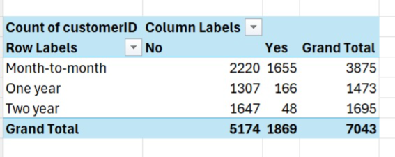

# Customer Churn Analysis

## 📌 Project Overview
This project analyzes customer data to identify patterns of churn.

## 🎯 Objective
- Identify customers likely to leave
- Understand reasons behind churn
- Provide business insights

## 🛠️ Tools Used
- Excel
- Python (coming soon)
- Power BI (coming soon)

## 📊 Current Progress
- Dataset understanding started
- Basic analysis in progress

## 🚀 Next Steps
- Data cleaning
- Visualization
- Model building
## 📈 Key Insights

- Customers with month-to-month contracts have the highest churn.
- Customers with one-year and two-year contracts are more stable.
- Long-term contracts significantly reduce customer churn.

## 📊 Analysis Screenshot

